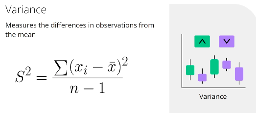

## Understanding Exploratory Data Analysis (EDA)

This process helps in understanding and summarizing data attributes using visual tools.

### Purpose of EDA:

* **Understand Data Structure:**
  * Use histograms, bar charts, and scatter plots to reveal data patterns and trends.
* **Detect Anomalies & Patterns:**
  * Identify misleading data points and significant patterns for better analysis.
* **Validate Assumptions:**
  * Check if data meets model assumptions, like normal distribution.

## Understanding Descriptive Statistics in EDA

### What Are Descriptive Statistics?

* **Descriptive Statistics** : Summarize data features into single numbers.
* **Example** : Average (mean) of a set of numbers.

### Common Descriptive Measures:

* **Mean** :
  * Calculate by summing data points and dividing by the total number.
  * **Note** : Can be skewed by extreme values (outliers).
* **Median** :
  * Represents the middle value when data is ordered.
  * Less affected by outliers, providing a more accurate center.
* **Variance** :
  * Measures data spread by averaging squared deviations from the mean.
  * 
* **Standard Deviation** :
  * Square root of variance, indicating data's average distance from the mean. Useful for assessing risk levels.
  * 量纲直观，与数据同尺度，易于解释

### 绘图库

matplotlib

plotly

* Plotly allows users to create dynamic, interactive plots that can be easily embedded in web applications.

## Understanding Outliers and Anomalies in Trading

Outliers and anomalies are distinct data points that deviate significantly from normal data patterns. In trading, these phenomena can signal unusual market activities:

* **Market Signals**
  * Sudden price changes,
  * volume spikes
  * unexpected market behaviors might reveal potential opportunities or important alerts.
* **Strategic Implications**
  * New trading strategies can evolve by recognizing market shifts indicated by outliers.
  * Outliers can impact mean, variance, and the precision of predictive models by skewing statistical metrics.
* **Detection Tools**
  * **Boxplots (Box and Whisker Plots):** Visualize data distribution to identify isolated data points, useful for spotting unusual daily stock returns.
  * **Scatter Plots:** Examine relationships between variables, such as trading volumes and stock prices.
  * **Rolling Statistics:** Utilize moving averages and standard deviations to track irregularities over time.
* **Considerations**
  * Outliers and anomalies may either be opportunities or risks, relying on the context and analysis. Awareness and identification of these patterns are vital for refining trading models.

## Understanding Data Relationships with Correlation and Covariance

### Correlation and Covariance:

* **Covariance(协方差)** : Measures how two variables move together.
  * **Positive Covariance** : Variables increase or decrease together.
  * **Negative Covariance** : As one variable increases, the other decreases.
* **Correlation（相关系数)** : Indicates the strength and direction of the relationship between two variables on a standardized scale from -1 to 1.
  * **Positive Correlation** : Perfect positive relationship is 1.
  * **Negative Correlation** : Perfect negative relationship is -1.
  * **Zero Correlation** : No relationship.

### Applications in Trading:

* Identify asset relationships for  **portfolio diversification** .
  * **High positive correlation** : Assets move in the same direction.
  * **Low or negative correlation** : Helps in reducing portfolio risk and improving diversification.

### Feature Selection in Model Building:

* **Correlation analysis** : Crucial for choosing model features.
* **Highly Correlated Variables** : May add noise and be redundant in model predictions.
* **Pair Plots** : Useful visualization tool for examining variable interactions.
* Example: Iris dataset visualizes variable connections like petal width and length, helping improve model accuracy.
