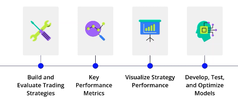
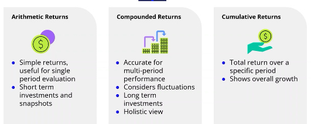
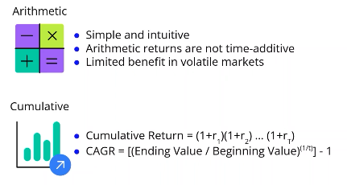
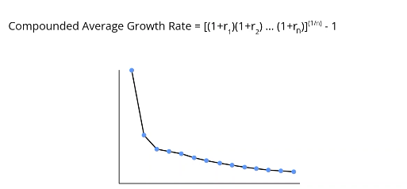
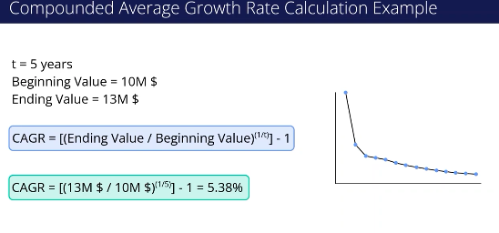

**various returns:**

* **Arithmetic Returns** : Suitable for short-term performance.
* **Compounded Returns** : Ideal for long-term assessment.
* **Cumulative Returns** : Useful for understanding overall investment growth.

### **Concept of Arithmetic Returns**

* Measure of investment performance.
* Calculated as (ending value - beginning value) / beginning value.

### **Limitations**

* Not suitable for multi-period analysis.
* Returns do not simply add up over time.

#### **Example**

1. **Starting Investment:** $10 million.
2. **First Year Result:**
   * Ending value: $11 million.
   * Arithmetic Return: 10%.
3. **Second Year Result:**
   * Ending value: $9.9 million.
   * Arithmetic Return: -10%.

### **Misinterpretation of Returns**

* Adding 10% and -10% yields a return of 0%, which is incorrect.
* Each year's return is based on its preceding year's ending value.

### **Conclusion**

* Correct calculation reflects a negative return of 1% over two years, highlighting the need for proper calculations beyond simple arithmetic addition.

### Types of Investment Returns

1. **Arithmetic Returns:**
   * Simplest method to measure performance.
   * Not time additive and can lead to errors over multiple periods.
2. **Cumulative Returns:**
   * Accounts for compounding effects.
   * Measures total growth over several periods.
3. **Compounded Annual Growth Rate (CAGR):**
   * Provides average annual growth rate.
   * Ideal for long-term investment assessments.

### Key Insights

* Arithmetic returns suit short-term investments and basic performance snapshots.
* Cumulative returns offer a complete picture of total investment growth.
* Compounded returns focus on long-term growth and annual rates.

### Essential Skills for Analysis

* **Choose the Right Formula:**
  * Use cumulative returns for overall assessments.
  * Use compounded formulas for annualized performance.

