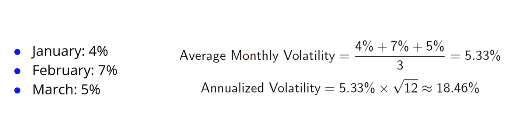
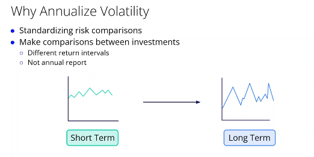
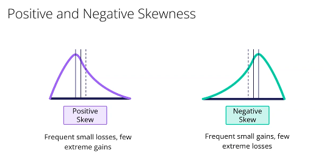
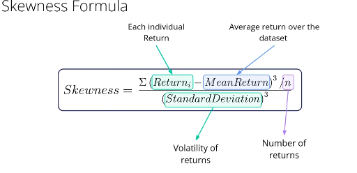
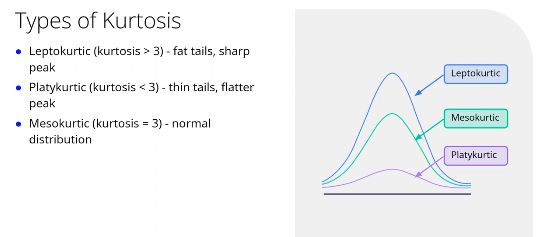
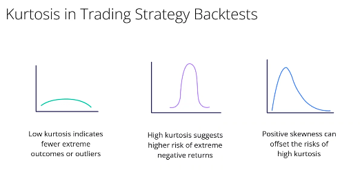
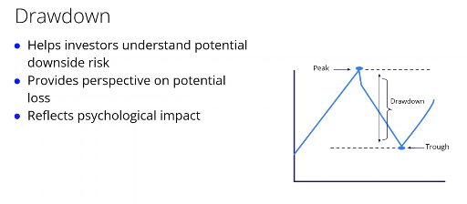

## Key Risk Measures in Trading Systems

1. **Volatility**
   * Measures fluctuation in investment returns.
   * Used to set stop-loss levels and determine position sizes.
2. **Skewness**
   * Analyzes return distribution asymmetry.
   * Evaluates balance between frequent small changes and extreme events.
3. **Kurtosis**
   * Indicates the likelihood of extreme return outcomes.
   * Assesses risk of rare, significant market events.
4. **Drawdown**
   * Measures decline from peak to trough in asset value.
   * Evaluates downside risk and psychological impact on investors.

### Practical Application

* Integrate these measures to construct a robust trading system.
* Regularly update risk measures to adapt strategies with changing market conditions.
* Leverage historical data to improve risk management methods.

## Calculating Volatility

即计算数组标准差

Analyzing volatility helps assess the risk of investments over different periods.

### Key Insights:

* **Volatility Comparison:** Determines how an asset's risk changes over varying time frames.
  * Short periods may show stability.
  * Long periods could reveal instability.
* **Annualized Volatility:** Transforms short-term volatility data to reflect a full year.
  * Useful for comparing investments with different reporting intervals.

### Formula Application:

* **Formula:**
  * Annualized Volatility = Volatility × √Number of Periods
* **Example:**
  * Monthly volatility = 2%
  * Annual Volatility = 2% × √12 ≈ 6.93%

### Limitations Of Annualized Volatility

Annualized volatility is commonly used to assess investment risks, but it's essential to recognize its limitations. Keep these points in mind:

* **Misleading Assumptions** :
  * Assumes normally distributed price returns, which isn’t always true. Markets can exhibit skewness (asymmetry) and kurtosis (fat tails), leading to potential misunderstanding of extreme returns.
* **Equal Weight to Positive/Negative Movements** :
  * All volatility is treated the same, ignoring that risk-averse investors might be more concerned about potential losses rather than gains.
* **Time Sensitivity** :
  * Highly sensitive to chosen time periods. Short-term and long-term volatility can differ, potentially misrepresenting current market stress.
* **Conclusion** :
  * Useful but should be supplemented with **other metrics to account for** financial market nuances,such as asymmetry and sometimes extreme nature return of finac

## Skewness In Finance

### Understanding Skewness in Distribution of Returns

Skewness measures the asymmetry in the distribution of returns around their mean, offering insights that volatility alone doesn't provide.

### Types of Skewness:

* **Positive Skewness** :
  * Indicates frequent small losses with occasional large gains.
* **Negative Skewness** :
  * Indicates frequent small gains with occasional large losses.

### Implications:

* Varies risk management and investment strategies based on skewness type.
* A non-zero skewness means an asymmetrical distribution.

## Kurtosis in Risk Management

### Importance of Kurtosis

* Kurtosis indicates the likelihood of extreme outcomes or outliers, which standard deviation or variance do not capture.
* It measures the extremity of the distribution, highlighting tail risk.
* Provides a complete view of tail risk, unlike skewness which measures asymmetry.

### Types of Kurtosis

* **Leptokurtic** : Kurtosis > 3, indicating sharp tails and higher chances of extreme values.
* **Platykurtic** : Kurtosis < 3, depicting flat tails and a lower probability of extreme values.
* **Mesokurtic** : Kurtosis = 3, resembling a normal distribution in tail risk.

  

### Application in Trading Strategies

* Low kurtosis denotes fewer extreme returns, beneficial for stable strategies.
* High kurtosis implies greater extreme risk but can be offset by positive skewness indicating potential gains.

## Drawdown in Investments

Drawdown is essential for investors who want to measure the decline in their investment portfolios. It provides insight into the potential loss, accounting for both financial and emotional aspects during the investment period.

**Steps to Calculate Drawdown:**

1. **Identify the Peak:** Determine the highest value before the largest decrease.
2. **Identify the Trough:** Find the lowest value after the peak, before new peak attainment.
3. **Calculate Drawdown:** Use the formula (Peak Value - Trough Value) / Peak Value.

Understanding drawdown aids in setting realistic expectations, managing risks, and making informed decisions about entering or exiting investments. It's a valuable metric for evaluating risk tolerance and planning investment strategies.
