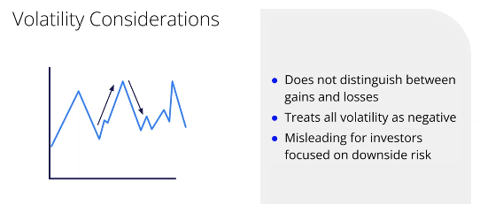
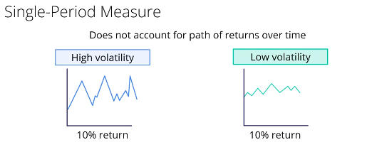
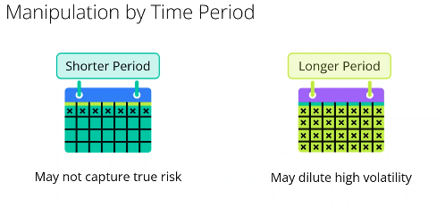
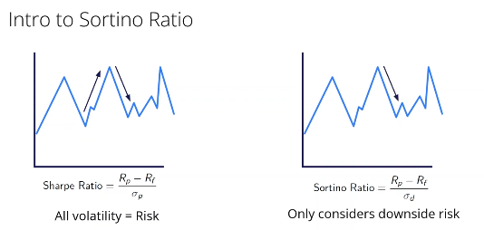
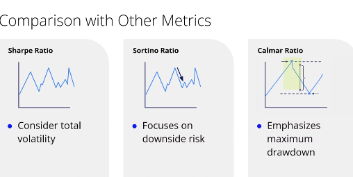

### risk-adjusted ratio

# Understanding the Risk-Free Rate

The risk-free rate is vital in financial calculations, acting as the benchmark for risky investment performances.

### Proxies for the Risk-Free Rate

1. **Treasury Bills (T-Bills)**
   * **Nature** : Short-term US government securities.
   * **Reason for Use** : Backed by the government, thus considered low risk.
2. **Government Bonds**
   * **Nature** : Long-term US Treasury bonds.
   * **Risks** : Interest rate and inflation risks, yet relatively safe.

### Limitations and Considerations

* **Non-zero Risk** : Even the safest assets hold minimal risks like inflation.
* **Variability by Country** : Risk levels depend on each country's economic stability.
* **Economic Influence** : Monetary policy and economic conditions can cause rate fluctuations.

## Practical Considerations for Using the Sharpe Ratio

### Limitations:

1. **Distribution Assumptions** :

* Assumes normal distribution.
* Financial returns can have extreme values not shown by standard deviation.

1. **Interest Rate Sensitivity** :

* Low rates can inflate the ratio, high rates can understate performance.

1. **Volatility Misinterpretation** :

   

* Treats all volatility as negative; doesn't differentiate upside from downside.

1. **Single-Period Measure** :

* Ignores return paths and varying risk levels in different periods.

1. **Manipulation Potential** :

* Changing analysis period impacts perceived risk and return.

1. **Historical Dependency** :

* Based on past data, which may not predict future outcomes.

### Practical Use:

1. **Combine with Other Measures** :

* Use Sortino and Calmar ratios for a fuller risk assessment.

1. **Examine Return Distribution** :

* Analyze skewness and kurtosis for risks not shown by Sharpe.

1. **Consider Economic Context** :

* Adjust calculations based on current interest rate environments.

1. **Use Consistent Time Periods** :

* Ensure consistency in time frames for meaningful comparisons.

1. **Evaluate Historical Context** :

* Consider market conditions and future projections.

1. **Include Qualitative Analysis** :

* Consider market trends and company-specific news for a broader view.

## Understanding the Sortino Ratio

The Sortino Ratio refines the Sharpe Ratio by focusing solely on downside risk, relevant for loss-averse investors. It offers a clearer picture of risk-adjusted returns for assets with asymmetric risk profiles.

## Understanding the Calmar Ratio

### Applications

1. **Long-term Strategies** : Identifies stable investments with less chance of severe losses.
2. **Hedge Funds** : Evaluates performance in more volatile investments.
3. **Portfolio Optimization** : Helps build high-return, low-drawdown portfolios.
4. **Market Stress** : Assesses an investment's ability to endure unfavorable conditions effectively.
