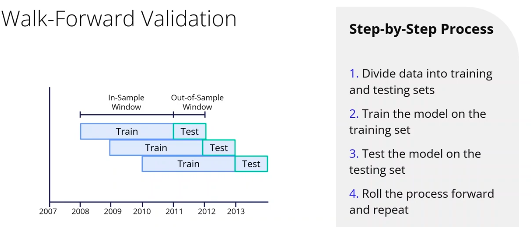
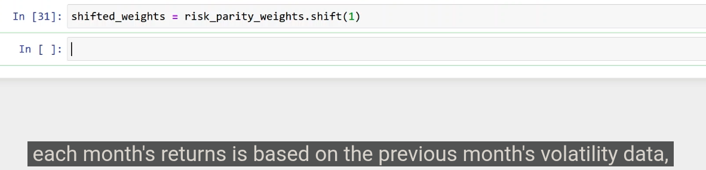

## Introduction to Walk Forward Validation

Learn about  **Walk Forward Validation** , an essential technique for financial time series analysis, designed to help manage investments effectively while avoiding look-ahead bias.

### Key Concepts:

* **Purpose** : Allows strategies to be adjusted based on past data without inadvertently using future information.
* **Look-Ahead Bias** : Future data should not influence current decisions as it can distort strategy performance.

## Understanding Rolling Windows with Pandas in Fin

to avoid look ahead bias.
